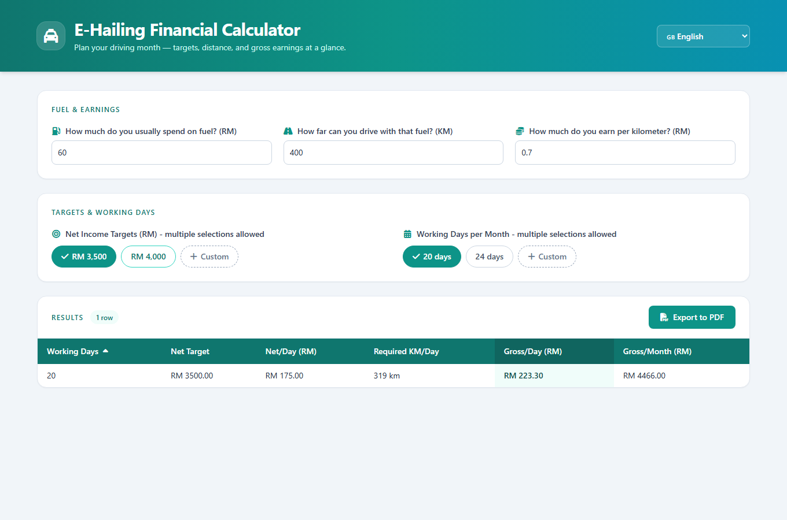

# E-Hailing Financial Calculator

**Live demo: [e-hailing-cal.vercel.app](https://e-hailing-cal.vercel.app)**

A single-page financial planning calculator for e-hailing drivers. Enter your usual fuel
spend, the distance that fuel covers, and your earnings per km; pick one or more monthly
net-income targets and working-day counts (presets or custom), and the app computes the
required km/day plus gross earnings per day and month for every combination — in a sortable
table you can export to PDF. If your fuel cost per km ever reaches your earnings per km, the
app flags the inputs as unprofitable instead of printing nonsense numbers. Bilingual UI
(English / Bahasa Melayu) via vue-i18n. One `index.html` + `app.js` + `lib/calc.js`, every
library loaded from a CDN — no build step, no backend.



> **New developer? Start with [`.docs/tldr.md`](.docs/tldr.md)** — every doc summarised on one
> page. The full guide lives in [`.docs/`](.docs/README.md).

## Prerequisites

| Tool | Version | Installed by |
| --- | --- | --- |
| PowerShell + winget | Windows 10/11 stock | — (the only true prerequisites) |
| Git | any recent | `setup.ps1` (winget) |
| Node.js | LTS | `setup.ps1` (winget) — Claude Code CLI + the Vitest test suite |
| uv + Python | latest | `setup.ps1` — serves the site (`python -m http.server`) |
| just | any recent | `setup.ps1` |
| Claude Code CLI | latest | `setup.ps1` (optional, for AI-assisted dev) |

## Quick start

```powershell
# 1. One-time machine setup (idempotent — safe to re-run)
pwsh ./setup.ps1

# 2. Close and reopen PowerShell so PATH updates land
# 3. Serve the calculator (background window)
just start

# 4. Open it in the default browser
just open
```

The app is now at **http://127.0.0.1:8118**. Stop it with `just stop`.

## Commands

Run `just` with no arguments to list every recipe. The ones you'll use daily:

| Command | What it does |
| --- | --- |
| `just start` | Serve on http://127.0.0.1:8118 in a background window (stops any previous run first) |
| `just serve` | Serve in the foreground (Ctrl+C to stop) |
| `just stop` | Kill only this repo's python server (path-scoped — other projects unaffected) |
| `just open` | Open http://127.0.0.1:8118 in the default browser |
| `just test` | Run the Vitest unit tests (installs dev deps on first run) |
| `just claudex` | Launch Claude Code (Sonnet, all permissions) |

## Testing

The calculator math lives in [`lib/calc.js`](lib/calc.js) — a pure, dependency-free ES module
imported by both the browser app and the test suite. [`tests/calc.test.js`](tests/calc.test.js)
covers:

- **Regression pins** — the profitable default inputs (RM 60 fuel / 400 km / RM 0.70 per km)
  must keep producing exactly the numbers the original in-component math did
  (319 km/day, RM 223.30 gross/day, RM 4,466 gross/month for RM 3,500 over 20 days).
- **The unprofitability guard** — cost/km ≥ earnings/km must flag the combo, never return a
  negative or Infinite `requiredKM` (see the Fixed note below).
- **Edge inputs** — zero `fuelKm`, zero earnings, unfilled custom rows.

```powershell
just test        # npm install (first run only) + vitest run
```

Vitest is a dev-only dependency; the served app remains 100% CDN, no build step.
`node_modules/` is git-ignored; `package-lock.json` is committed so installs are reproducible.

## Troubleshooting

### `just` or `uv` is not recognized

`setup.ps1` finished but the current shell still has the old PATH. Close and reopen
PowerShell, then run the command again. If it persists, re-run `pwsh ./setup.ps1`.

### Port 8118 is already in use

A previous server from this repo is still running. `just stop` kills it (path-scoped, so other
projects' servers survive). `just start` also runs `stop` first automatically.

### The page loads but is blank or unstyled

Every library (Vue, vue-i18n, Tailwind, jsPDF, Font Awesome) loads from a CDN at page load.
With no internet the local server still returns 200 but the app never mounts and the page
renders unstyled. Reconnect and reload.

### Negative "Required KM/Day" — **Fixed (v2)**

Older versions had no unprofitability guard: when fuel cost per km ≥ earnings per km,
`requiredKM = ceil(netPerDay / netPerKm)` divided by a zero-or-negative `netPerKm` and the
table printed rows like `-1167 km` (or `Infinity km` at exact break-even). The fix followed
the bug's own trail, test-first:

1. **Found** — long documented in this very section as a known gotcha.
2. **Failing test** — the math was extracted into pure `lib/calc.js` (regression-pinned to
   the old numbers), then `flags unprofitable when fuel cost per km >= earnings per km` was
   written against it and run RED.
3. **Fixed** — `computeRequirement()` now returns `unprofitable: true` with null figures; the
   UI shows a red warning banner (in both English and Bahasa Melayu) and renders "—" in the
   table and PDF export instead of impossible distances.

If you still see negative distances, you are running a pre-v2 checkout — pull `main`.

More in [`.docs/06-troubleshooting/common-issues.md`](.docs/06-troubleshooting/common-issues.md).

## Project layout

```
e-hailing-calculator/
  index.html      # UI markup — Vue template, Tailwind classes, CDN <script> tags
  app.js          # Vue 3 app — i18n messages, reactive inputs, PDF export (ES module)
  lib/calc.js     # pure calculator math — imported by app.js and the tests
  tests/          # Vitest suite: regression pins, unprofitability guard, edge inputs
  docs/images/    # README screenshot
  package.json    # dev-only test harness (vitest); the app itself has no build step
  justfile        # dev recipes: start / serve / stop / open / test
  setup.ps1       # one-time machine bootstrap (idempotent)
  README.md
  CLAUDE.md
  .mcp.json.stub  # committed MCP placeholders (real .mcp.json is git-ignored)
  .docs/          # numbered developer documentation
  .claude/        # skills, hooks, settings, memory
```
